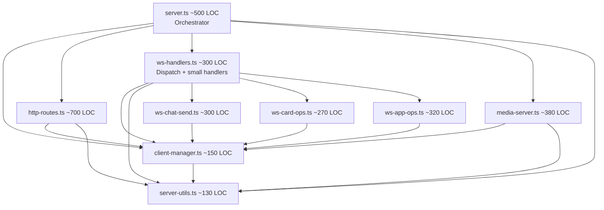

# server.ts Decomposition Design — Sprint 18

**Date**: 2026-04-02 | **Author**: Coder Agent (implement-b) | **Status**: Design Only — Zero Code Changes

---

## 1. Current State

`server/src/server.ts` is **3,290 LOC** — the single largest file in the codebase. It contains the Express/HTTP server, WebSocket connection management, all REST API endpoints, all WebSocket message handlers, media serving, file upload, and server lifecycle management.

### Logical Section Map

| Section | Lines | LOC | Description |
|---------|-------|-----|-------------|
| Imports & Types | 1–65 | 65 | External deps, `ConnectedClient` interface |
| Global State & Utilities | 66–210 | 145 | `clients` map, `activeAccount`, MIME detection, `toMediaUrl()`, `scanProjects()`, client accessors |
| Research Routing | 212–408 | 197 | `routeToResearch()`, `routeToImageSearch()`, `analyzeImageForResearch()` |
| Server Init (`startEnsoServer`) | 410–605 | 196 | Account setup, app rehydration, catalog validation, shell PTY loading, Express app creation |
| Unauthenticated HTTP Routes | 538–832 | 295 | `/health`, `/api/version`, `/media/:encodedPath` (Range support, ffmpeg transcoding), `/media/proxy/:encodedUrl` |
| Authenticated HTTP Routes | 834–1543 | 710 | Token auth middleware, card share, domain evolution, Claude commands, projects CRUD, branch management, team generation, sprint archives, sessions, service keys, growth/discovery, memory, conversations, collections, `/upload`, `/api/image-analyze`, `/transcribe` |
| WebSocket Setup | 1552–1670 | 119 | WSS on `/ws`, keep-alive pings, connection handler, reconnect replay, session init |
| WS Message Handlers | 1723–3115 | 1,393 | 30+ `case` branches in a single switch statement |
| Disconnect & Shutdown | 3130–3259 | 130 | Close handler (10-min mobile buffer), graceful stop, post-startup hooks |
| File Utilities | 3262–3290 | 29 | `fuzzyResolveFile()` for corrupted unicode filenames |

### Largest WS Message Handlers

| Case | LOC | Notes |
|------|-----|-------|
| `chat.send` | 253 | Main router: Claude Code, researcher, smart classification, agent pipeline |
| `apps.run` | 197 | Dynamic + built-in app execution, card context registration |
| `card.summarize` | 121 | Summary + podcast generation pipeline |
| `image_research` | 71 | Image → research topic via Gemini Vision |
| `apps.list` | 55 | Discover and list all available apps |
| `orchestration.*` | 72 | Multi-step planning handlers |
| `shell.*` | 43 | PTY shell management |
| All others | ~581 | 20+ smaller handlers (10–35 LOC each) |

### Key Shared State

- **`clients: Map<string, ConnectedClient>`** — In-memory client registry, accessed by WS handlers, HTTP routes, and broadcast helpers
- **`activeAccount: ResolvedEnsoAccount | null`** — Mutable runtime account, read by most handlers, written by settings handlers
- **`activePort: number`** — Server port, used for `toMediaUrl()` construction
- **`cleanupTimers`** — Per-client disconnect timers for mobile reconnect buffering

---

## 2. Target Architecture

Split into **5 extracted modules** + a **residual orchestrator** (~500 LOC) that wires everything together.

### Module Inventory

#### `server-utils.ts` (~130 LOC)
**Contents**: Pure utility functions with zero server state dependencies.
- `detectMimeFromMagicBytes()` — MIME from file header signatures
- `mimeFromExtension()` — MIME from file extension
- `toMediaUrl()` — Convert file path to base64url-encoded HTTP endpoint
- `fuzzyResolveFile()` — Corrupted unicode filename recovery
- `scanProjects()` — Discover git projects in common directories

**Dependencies**: None (pure functions, accept `port` as parameter for `toMediaUrl`)

#### `client-manager.ts` (~150 LOC)
**Contents**: Client registry and session management.
- `ConnectedClient` interface
- `clients` Map + accessor functions (`getActiveAccount`, `getConnectedClient`, `getClientsBySession`, `getClientsByPeerId`, `getAllClients`)
- `broadcastToSession()` — Send message to all clients in a session
- `resolveConversationId()` — Validate/resolve conversation ID with fallback
- `registerClient()` / `removeClient()` — Lifecycle management
- `activeAccount` getter/setter

**Dependencies**: `server-utils.ts` (for `resolveConversationId` fallback logic)

**Cross-session contamination fix**: `resolveConversationId()` lives here, making it the natural location for any session isolation fixes identified in Sprint 17 E7 investigation.

#### `media-server.ts` (~380 LOC)
**Contents**: Express routes for media serving, file upload, and transcription.
- `/media/:encodedPath` — Local file streaming with Range support and ffmpeg transcoding
- `/media/proxy/:encodedUrl` — External image proxy
- `/upload` — Multipart/binary upload (50MB, Capacitor base64 decode, MIME detection)
- `/transcribe` — Audio transcription endpoint
- `/api/image-analyze` — Gemini Vision analysis

**Dependencies**: `server-utils.ts` (MIME detection, fuzzy resolve), `client-manager.ts` (account for auth)

**Exports**: `mountMediaRoutes(app: Express, deps: MediaDeps): void`

#### `http-routes.ts` (~700 LOC)
**Contents**: All authenticated REST API endpoints.
- Token auth middleware
- Card share endpoints (`/api/share-token`, `/api/create-share`, `/api/card/:cardId/state`)
- Domain evolution API (`/domain-evolution/jobs`)
- Claude commands, action log, projects CRUD, branch management
- Team generation, sprint archives, sessions, orchestrations
- Service keys, growth/discovery, memory, conversations, collections
- Health check, version, APK download, demo assets, tunnel registry

**Dependencies**: `client-manager.ts` (auth, account), `server-utils.ts`

**Exports**: `mountHttpRoutes(app: Express, deps: HttpDeps): void`

#### `ws-handlers.ts` (~800 LOC) with sub-modules
**Contents**: WebSocket message dispatch router + handler implementations.

Recommended sub-module split for the switch statement:

| Sub-module | Cases | Est. LOC | Description |
|------------|-------|----------|-------------|
| `ws-chat-send.ts` | `chat.send`, `chat.history` | ~300 | Main chat router, history loading |
| `ws-card-ops.ts` | `card.*` (summarize, evolve, release, enhance, build_app, persist, delete_all_apps, action) | ~270 | All card operations |
| `ws-app-ops.ts` | `apps.*` (list, run, delete, reload), `app.promote`, `app.save_to_codebase` | ~320 | App lifecycle |
| `ws-handlers.ts` (residual) | All remaining cases (settings, shell, sessions, orchestration, discovery, evolution, monitor, etc.) | ~300 | Smaller handlers stay in main dispatch |

**Dependencies**: `client-manager.ts` (client lookup, broadcast), `server-utils.ts`, plus all existing external modules (agent-adapter, outbound, claude-code, etc.)

**Exports**: `handleWsMessage(client: ConnectedClient, msg: ClientMessage, deps: WsDeps): Promise<void>`

#### `server.ts` Residual Orchestrator (~500 LOC)
**Contents**: Server lifecycle only — no business logic.
- `startEnsoServer()` function signature and initialization
- Express app creation and middleware
- Mount routes: `mountMediaRoutes()`, `mountHttpRoutes()`
- WebSocket server setup and connection handler
- Delegate messages to `handleWsMessage()`
- Disconnect handler with mobile reconnect buffering
- Graceful shutdown / stop function
- Post-startup hooks (migrate journals, ensure default project, research monitor)

---

## 3. Extraction Order

Extract in **dependency order** — leaf modules first, dependents last.

```
Step 1: server-utils.ts      (zero dependencies — pure functions)
Step 2: client-manager.ts    (depends on server-utils only)
Step 3: media-server.ts      (depends on server-utils + client-manager)
Step 4: http-routes.ts       (depends on client-manager + server-utils)
Step 5: ws-handlers.ts       (depends on all above + external modules)
  Step 5a: ws-chat-send.ts   (sub-module of ws-handlers)
  Step 5b: ws-card-ops.ts    (sub-module of ws-handlers)
  Step 5c: ws-app-ops.ts     (sub-module of ws-handlers)
```

### Per-Step Protocol

Each step follows this sequence:
1. Create the new module file
2. Move functions/types from server.ts → new file
3. Add imports in server.ts to call the extracted module
4. Run `npx tsc --noEmit` — must pass
5. Smoke test: start server, verify affected functionality works
6. **Commit** — one commit per extraction step (7 total commits)

---

## 4. Dependency Graph



### Dependency Interface Pattern

Each extracted module receives its dependencies via a typed `deps` object rather than importing global state:

```typescript
// Example: MediaDeps interface
interface MediaDeps {
  getAccount: () => ResolvedEnsoAccount | null;
  getPort: () => number;
  detectMime: typeof detectMimeFromMagicBytes;
  fuzzyResolve: typeof fuzzyResolveFile;
  toMediaUrl: typeof toMediaUrl;
}

// Mount call in server.ts orchestrator
mountMediaRoutes(app, {
  getAccount: () => activeAccount,
  getPort: () => activePort,
  detectMime: detectMimeFromMagicBytes,
  fuzzyResolve: fuzzyResolveFile,
  toMediaUrl,
});
```

This pattern:
- Makes dependencies explicit and testable
- Avoids circular imports
- Enables unit testing with mock deps

---

## 5. Critical Constraints

### Commit Discipline
Each extraction = **separate commit + smoke test**. Never extract two modules in the same commit. This ensures clean rollback if any extraction breaks something.

### Type Safety
All inter-module boundaries must be fully typed. The `ConnectedClient` interface moves to `client-manager.ts` and is imported everywhere else. No `any` casts at module boundaries.

### No Behavior Changes
Sprint 18 decomposition is a **pure refactor** — zero behavior changes, zero new features. The diff should be 100% moves + import rewiring. Any bug fixes discovered during decomposition should be separate commits.

### Backwards Compatibility
External modules that import from `server.ts` (if any) should continue to work via re-exports during a transition period.

### Performance
WebSocket message routing must remain O(1) — the switch statement pattern is preserved, just distributed across modules. No runtime dispatch overhead from the split.

---

## 6. LOC Budget

| Module | Estimated LOC | % of Total |
|--------|--------------|------------|
| `server.ts` (orchestrator) | ~500 | 15% |
| `server-utils.ts` | ~130 | 4% |
| `client-manager.ts` | ~150 | 5% |
| `media-server.ts` | ~380 | 12% |
| `http-routes.ts` | ~700 | 21% |
| `ws-handlers.ts` (dispatch + small) | ~300 | 9% |
| `ws-chat-send.ts` | ~300 | 9% |
| `ws-card-ops.ts` | ~270 | 8% |
| `ws-app-ops.ts` | ~320 | 10% |
| **Total** | **~3,050** | — |

Note: ~240 LOC reduction from total (3,290 → 3,050) expected due to removal of duplicate imports and consolidation of shared type definitions.

---

## 7. Research Routing Functions

The three research routing functions (`routeToResearch`, `routeToImageSearch`, `analyzeImageForResearch` — 197 LOC) are called from both `chat.send` and `image_research` WS handlers. They should live in `ws-chat-send.ts` since that is their primary caller, or optionally in a dedicated `research-routing.ts` if they grow further.

---

## 8. Risk Assessment

| Risk | Likelihood | Impact | Mitigation |
|------|-----------|--------|------------|
| Extraction breaks WebSocket state | Medium | High | Per-step smoke test, typed deps |
| Circular import between modules | Low | Medium | Dependency injection via `deps` objects |
| Merge conflicts with concurrent work | Medium | Low | Extract in order, rebase before each step |
| Mobile reconnect buffer breaks | Low | High | Keep buffer logic in orchestrator until fully tested |
| Research monitor loop breaks | Low | Medium | Keep in orchestrator's post-startup hooks |
