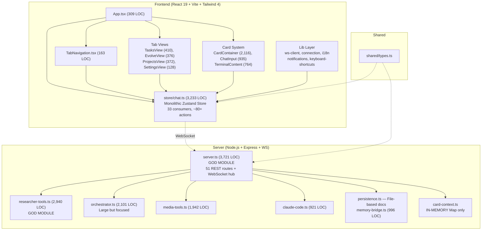
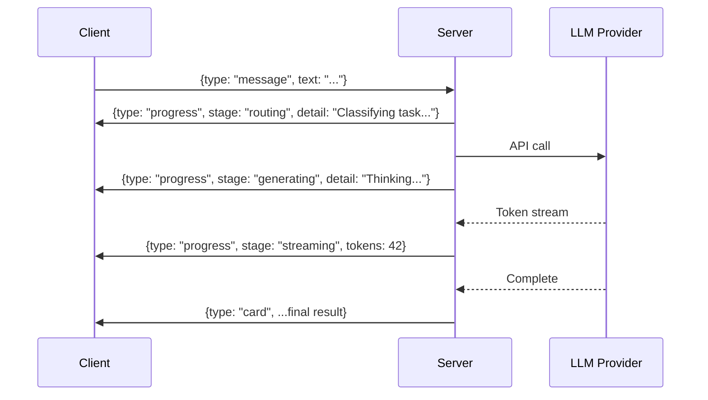
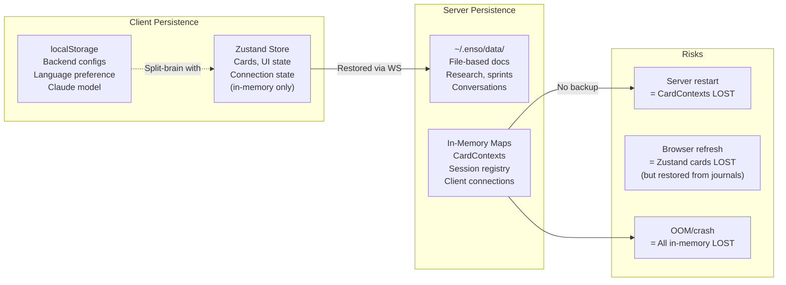
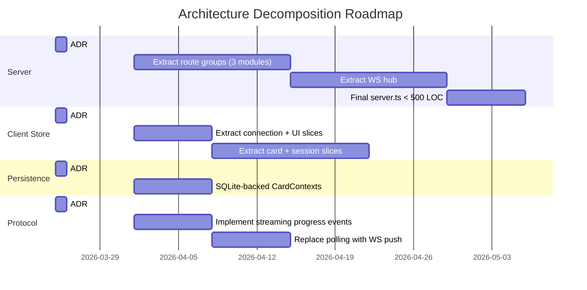

# Sprint 13 — Software Architect Evaluation
**Elena Vasquez, Software Architect | 2026-03-25**

---

## 1. Summary & Verdict

**Architecture Health Score: 5.5/10 — Functional but carrying significant structural debt.**

Enso's architecture has grown rapidly through feature accretion. The product works — research engine is excellent (8-9/10 per personas), 5-tab navigation is solid, and the core WebSocket-driven card system is clever. But underneath, the codebase exhibits classic scaling anti-patterns: god modules on the server (server.ts at 3,721 LOC with 51 REST routes), a monolithic Zustand store on the client (3,233 LOC consumed by 33 files), in-memory-only CardContexts with no persistence, and a split-brain connection status bug caused by two independent sources of truth.

**Sprint 13 recommendation:** Fix the 3 bugs (connection status, chat progress, stale errors), complete TabHeader consolidation, and deliver a design-only Architecture Decision Record (ADR) for progress feedback. Do NOT attempt structural refactoring this sprint — the risk-to-benefit ratio is wrong for a consolidation sprint. Instead, document the decomposition plan for Sprint 14+.

---

## 2. Architecture Health Assessment

### 2.1 Component Inventory



### 2.2 Module-by-Module Assessment

| Module | LOC | Concern | Health | Notes |
|--------|-----|---------|--------|-------|
| `server.ts` | 3,721 | God module: HTTP, WS, routing, business logic, middleware | 3/10 | 51 REST routes + WS hub in one file. Critical decomposition target. |
| `researcher-tools.ts` | 2,940 | God module: all research tool implementations | 4/10 | Needs split into per-tool modules. |
| `orchestrator.ts` | 2,101 | Multi-agent orchestration engine | 5/10 | Large but more focused. Could extract plan parsing. |
| `media-tools.ts` | 1,942 | Media processing pipeline | 5/10 | Domain-cohesive but still oversized. |
| `store/chat.ts` | 3,233 | Monolithic client state | 4/10 | Mixes UI, connection, card, session, and orchestration state. |
| `card-context.ts` | 167 | Card interaction contexts | 3/10 | **In-memory `Map` — all CardContexts lost on server restart.** |
| `persistence.ts` | 250 | File-based document persistence | 7/10 | Clean abstraction, well-documented, auto-pruning. Good pattern. |
| `TabNavigation.tsx` | 163 | 5-tab navigation | 8/10 | Clean, well-structured. Desktop rail + mobile bar sharing TABS array. |
| `App.tsx` | 309 | Application shell | 7/10 | Clean composition. Proper error boundary at root. |

---

## 3. Top Architectural Concerns

### Concern 1: Server.ts God Module (Severity: HIGH)

**Problem:** `server.ts` is 3,721 LOC containing 51 REST endpoints, the WebSocket hub, client management, session orchestration, file upload handling, and business logic — all in a single file. This is the #1 maintainability risk.

**Evidence:**
- 51 `app.get/post/put/delete()` calls (counted via grep)
- 8 exported symbols (should be ~2 for a server module)
- Imports from 20+ internal modules
- Contains both infrastructure (express setup, WS ping, middleware) and domain logic (card evolution, research, project management)

**Impact:** Any developer touching one feature risks breaking another. Merge conflicts are inevitable if two features touch routing. Test isolation is impossible.

**Proposed Decomposition:**
```
server/src/
  server.ts          → Bootstrap, middleware, static serving (~200 LOC)
  routes/
    api-cards.ts     → Card CRUD, actions, state, sharing
    api-sessions.ts  → Session management, Claude Code
    api-projects.ts  → Project management, teams, sprints
    api-research.ts  → Research endpoints
    api-evolution.ts → Evolution sprints, discovery
    api-media.ts     → Media upload, proxy, processing
    api-admin.ts     → Health, debug, system config
  ws/
    hub.ts           → WebSocket connection management
    handlers.ts      → Message routing and processing
```

**Sprint 13 action:** Design-only. Document this decomposition as an ADR. Do not refactor during consolidation.

### Concern 2: Monolithic Zustand Store (Severity: HIGH)

**Problem:** `store/chat.ts` is 3,233 LOC with ~80+ actions, consumed by 33 separate files. It mixes:
- UI state (activeTab, chatViewOpen, cardSearchVisible)
- Connection state (connectionState, _wsClient)
- Card data (cards, cardOrder, pinnedCards)
- Session state (codeSessionId, claudeModel, projects)
- Orchestration state (startOrchestration, pauseOrchestration)
- Conversation state (conversationsList, activeConversationId)

**Impact:**
- Every component re-evaluates selectors when any state slice changes
- State transitions are hard to trace (80+ actions in one file)
- Testing requires mocking the entire store
- No state normalization — cards stored as `Record<string, Card>` but relationships (pins, orders) managed separately

**Proposed Decomposition:**
```typescript
// Slice architecture (Zustand supports slices natively)
store/
  connection.ts    → connectionState, _wsClient, connect, disconnect
  cards.ts         → cards, cardOrder, pinnedCards, card CRUD
  session.ts       → codeSessionId, claudeModel, projects
  conversations.ts → conversationsList, activeConversationId
  orchestration.ts → orchestration actions
  ui.ts            → activeTab, chatViewOpen, sidebar state
  chat.ts          → Composer store combining slices
```

**Sprint 13 action:** No action. Document slice architecture for Sprint 14.

### Concern 3: Connection Status Split-Brain (Severity: HIGH — Active Bug)

**Problem:** The Me tab shows contradictory connection status because two independent sources of truth are read at render time:

1. `getActiveBackend()` → reads from **localStorage** (persisted backend config)
2. `useChatStore((s) => s.connectionState)` → reads from **Zustand** (WebSocket state)

In `SettingsView.tsx:64-67`:
```tsx
// Dot color: uses Zustand connectionState ✓
<div className={`... ${state === "connected" ? "bg-emerald-400" : ...}`} />
// Label: uses localStorage getActiveBackend() — shows name even when disconnected
<p>{active ? active.name : "Not connected"}</p>
// Subtitle: uses Zustand connectionState as text
<p className="... capitalize">{state}</p>
```

When a saved backend config exists but WebSocket is disconnected: dot is red, label shows backend name (looks "connected"), subtitle says "disconnected". Three personas independently flagged this as contradictory.

**Root Cause:** Architectural — two independent state stores (localStorage vs Zustand) for related data with no synchronization.

**Fix (Sprint 13 — Quick Win):**
```tsx
// Option A: Derive display text from connectionState only
<p>{state === "connected" ? (active?.name ?? "Connected") :
    state === "connecting" ? "Connecting..." : "Not connected"}</p>
<p className="text-xs text-gray-500">
  {state === "connected" ? active?.url ?? "" :
   active ? `Last: ${active.name}` : "No server configured"}
</p>
```

**Long-term fix:** Merge backend config into Zustand store as the single source of truth. LocalStorage becomes a persistence layer, not a read source.

### Concern 4: CardContexts In-Memory Only (Severity: HIGH)

**Problem:** `card-context.ts:48` stores all card interaction contexts in an in-memory `Map<string, CardContext>`:
```typescript
export const cardContexts = new Map<string, CardContext>();
```

**Impact:**
- Server restart = all CardContexts lost
- Card actions (enhance, evolve, share) fail silently after restart
- Shared card links become dead (scoped shares reference context by ID)
- No way to recover from OOM kills or process crashes

**Evidence:** The `persistence.ts` module provides a clean file-based persistence pattern that CardContexts doesn't use. Memory-bridge handles conversation persistence but not card contexts.

**Proposed Solution:**
```
Phase 1 (Sprint 14): Persist CardContexts to SQLite/file on mutation
Phase 2 (Sprint 15): Add TTL-based eviction with disk-backed reload
```

**Sprint 13 action:** Design-only. Include in ADR.

### Concern 5: No Progress Feedback Architecture (Severity: MEDIUM-HIGH)

**Problem:** Jordan Kim rated chat at 4/10 because zero visual feedback is shown during response generation. The WebSocket protocol has no streaming/progress events for:
- Chat message processing (LLM call start → token streaming → completion)
- Claude Code session progress
- Research phase transitions
- Build compilation steps

**Current protocol:** Client sends `{type: "message", text: "..."}`, server processes asynchronously, eventually sends `{type: "card", ...}` with the complete result. No intermediate events.

**Proposed Progress Event Architecture:**



**Protocol extension (backward-compatible):**
```typescript
// New ServerMessage variant
interface ProgressMessage {
  type: "progress";
  operationId: string;      // Correlates with the originating message
  stage: "routing" | "queued" | "generating" | "streaming" | "building" | "complete";
  detail?: string;           // Human-readable status
  percent?: number;          // 0-100 for determinate progress
  tokenCount?: number;       // For streaming stage
}
```

**Client implementation:**
- On `progress.stage === "generating"`: Show typing indicator / skeleton
- On `progress.stage === "streaming"`: Show animated skeleton with token count
- On card receipt: Replace skeleton with actual content

**Sprint 13 action:** Design this ADR. Implementation in Sprint 14.

### Concern 6: Duplicate Utility Functions (Severity: LOW)

**Problem:** `timeAgo()`, `formatDate()`, `formatElapsedTime()` are copy-pasted across:
- `TasksView.tsx:113-128` (formatElapsedTime + timeAgo)
- `EvolveView.tsx:31-41` (timeAgo + formatDate)
- `ProjectsView.tsx:34-44` (formatDate + timeAgo)

**Fix (Sprint 13 — Quick win, part of TabHeader consolidation):**
Extract to `src/lib/format-time.ts` and import. ~15 minutes of work.

### Concern 7: Polling vs. Push for Task Status (Severity: MEDIUM)

**Problem:** `TasksView.tsx:188-190` polls `/api/sessions` every 5 seconds:
```typescript
useEffect(() => {
  fetchStatus();
  const interval = setInterval(fetchStatus, 5000);
  return () => clearInterval(interval);
}, [fetchStatus]);
```

The server already has a WebSocket connection. Task status changes should be pushed, not polled. This adds unnecessary HTTP overhead and introduces 0-5s staleness.

**Sprint 13 action:** No action. Queue for Sprint 14 alongside progress feedback architecture.

---

## 4. 5-Tab Navigation Architecture Assessment

**Score: 7.5/10 — Solid foundation, minor issues.**

### What Works Well
- **TABS array is shared** between `DesktopTabRail` and `MobileTabBar` — no duplication
- **Clean conditional rendering** for desktop (rail) vs mobile (bottom bar)
- **Smart mobile tab hiding** — `MobileTabBar` returns null when chatViewOpen (correct UX)
- **TabHeader abstraction** — reusable controls-only header for tabs needing action buttons
- **i18n-ready** — all tab labels use translation keys
- **Active state indicators** — desktop has left-edge pill, mobile has color change + bold

### Issues Found
1. **MobileTabBar safe area** uses `pb-[env(safe-area-inset-bottom)]` correctly, but DesktopTabRail doesn't account for macOS traffic lights position — currently not a problem because 60px width is sufficient
2. **No deep-linking** — Tab state is Zustand-only, no URL synchronization. Browser back/forward doesn't work for tab changes
3. **Tab transition animations** exist for mobile (`mobile-view-enter`) but desktop tab switches are instant — inconsistent experience

### Uncommitted File Assessment

6 modified files in git status:
- `src/App.tsx` — TabHeader import consolidation
- `src/components/TabNavigation.tsx` — TabHeader definition moved here
- `src/components/TasksView.tsx` — Uses imported TabHeader
- `src/components/EvolveView.tsx` — Uses imported TabHeader pattern
- `src/components/ProjectsView.tsx` — Uses imported TabHeader pattern
- `src/components/SettingsView.tsx` — Connection status section
- `src/components/SettingsPanel.tsx` — Settings modal improvements

**Assessment:** The TabHeader consolidation (moving it to TabNavigation.tsx and importing from there) is architecturally correct. This should be committed as-is after the connection status bug fix. The consolidation reduces code duplication and establishes TabHeader as the canonical controls-bar component for all tabs.

---

## 5. Data Flow & Persistence Analysis



**Key persistence gaps:**
1. **CardContexts** — No persistence. Lost on server restart.
2. **Session registry** — In-memory. Lost on restart (acceptable — sessions are ephemeral).
3. **Client Zustand state** — In-memory but restored from server-side journals on reconnect (good pattern).
4. **Conversation history** — Persisted to `~/.enso/data/` via memory-bridge (good pattern).

---

## 6. Error Handling & Resilience

**Score: 5/10 — Basic coverage, significant gaps.**

| Area | Status | Notes |
|------|--------|-------|
| Root error boundary | Present | `AppErrorBoundary` catches React crashes |
| Per-tab error boundaries | **Missing** | A crash in EvolveView takes down the entire app |
| API error handling | Partial | Most fetch calls catch errors but silently swallow them (`catch { /* ignore */ }`) in EvolveView and ProjectsView |
| WebSocket reconnection | Good | Automatic reconnect with boot-ID detection for server restarts |
| Graceful degradation | Weak | No offline mode, no stale-data indicators |
| Rate limiting | None | No client-side debounce on polling or rapid tab switches |

**Sprint 13 recommendation:** The silent `catch { /* ignore */ }` blocks in EvolveView (`src/components/EvolveView.tsx:73,86`) and ProjectsView (`src/components/ProjectsView.tsx:100`) should at minimum log to console. Not a priority fix, but worth noting in the debt inventory.

---

## 7. Sprint 13 Implementation Recommendations

### Must-Do (Bug Fixes)

| # | Item | Owner | Estimated Effort | Architectural Risk |
|---|------|-------|-----------------|-------------------|
| 1 | Fix Me tab connection status contradiction | EM (David Park) | 30 min | None — isolated to SettingsView.tsx |
| 2 | Add chat response progress indicator | EM + Architect | 2-4 hours | Low — extends WS protocol, client skeleton |
| 3 | Complete TabHeader consolidation | EM | 30 min | None — already done, needs commit |
| 4 | Fix stale error strings in media-ai-gateway | EM | 15 min | None — string replacement |

### Connection Status Fix — Architectural Guidance

The fix should **not** merge localStorage and Zustand (too large a change for consolidation sprint). Instead, derive all display values from `connectionState`:

```tsx
// SettingsView.tsx — Connection row
const stateLabel = state === "connected"
  ? (active?.name ?? "Server")
  : state === "connecting"
  ? "Connecting..."
  : "Disconnected";

const stateSubtitle = state === "connected"
  ? (active?.url ? new URL(active.url).hostname : "Connected")
  : active
  ? `Tap to reconnect to ${active.name}`
  : "No server configured";
```

### Chat Progress Indicator — Architectural Guidance

**Minimum viable implementation (Sprint 13):**
1. Server: Emit `{type: "thinking"}` on WebSocket when LLM call begins
2. Client: Show typing indicator in CardTimeline when `isWaiting` is true
3. Client: Auto-dismiss when card arrives

**This requires:**
- ~20 LOC server-side (emit event in `handleInbound` after task classification)
- ~40 LOC client-side (thinking indicator component + state hook)
- Zero protocol breaking changes (new message type is additive)

### Design-Only Deliverables

| # | ADR Topic | Content |
|---|-----------|---------|
| 5 | Progress feedback architecture | Full protocol spec (Section 3, Concern 5 above) |
| 6 | Server.ts decomposition roadmap | Route grouping plan (Section 3, Concern 1 above) |
| 7 | Zustand store slice architecture | Slice boundaries (Section 3, Concern 2 above) |
| 8 | CardContexts persistence strategy | SQLite/file options (Section 3, Concern 4 above) |

---

## 8. Technical Debt Inventory

| ID | Debt Item | Severity | Effort to Fix | Sprint Target |
|----|-----------|----------|---------------|---------------|
| TD-1 | server.ts god module (3,721 LOC, 51 routes) | High | Large (2-3 sprints) | Sprint 14-16 |
| TD-2 | Zustand monolithic store (3,233 LOC, 33 consumers) | High | Large (2 sprints) | Sprint 15-16 |
| TD-3 | CardContexts in-memory only | High | Medium (1 sprint) | Sprint 14 |
| TD-4 | researcher-tools.ts god module (2,940 LOC) | Medium | Medium (1 sprint) | Sprint 14 |
| TD-5 | Duplicate utility functions (timeAgo, formatDate) | Low | Quick win | Sprint 13 |
| TD-6 | Silent error swallowing (`catch { /* ignore */ }`) | Medium | Quick win | Sprint 14 |
| TD-7 | Polling task status instead of WS push | Medium | Medium | Sprint 14 |
| TD-8 | No per-tab error boundaries | Medium | Quick win | Sprint 14 |
| TD-9 | No URL-based deep linking for tabs | Low | Medium | Sprint 15 |
| TD-10 | No offline mode / stale-data indicators | Low | Large | Sprint 16+ |

---

## 9. Trade-off Analysis

### Option A: Fix-Only Sprint (RECOMMENDED)
**What:** Fix the 3 bugs, consolidate TabHeader, design ADRs for future refactoring.
**Pros:** Zero regression risk. Addresses highest-frequency persona complaints. Establishes architectural roadmap for future sprints.
**Cons:** Does not reduce technical debt.
**Architectural impact:** None (preserves current architecture).

### Option B: Fix + Begin Store Slicing
**What:** Fix bugs AND start splitting Zustand store into slices.
**Pros:** Begins addressing TD-2, the second-highest-severity debt item.
**Cons:** Store refactoring touches 33 files. Any slice boundary mistake cascades. Testing burden is enormous for a consolidation sprint.
**Architectural impact:** High risk. Store is the nervous system of the frontend.

### Option C: Fix + Begin Server Decomposition
**What:** Fix bugs AND extract 2-3 route groups from server.ts.
**Pros:** Begins addressing TD-1, the highest-severity debt item.
**Cons:** Route extraction requires careful dependency analysis. Shared middleware, client management, and WebSocket state are deeply interleaved in server.ts.
**Architectural impact:** Medium risk if done carefully, but exceeds consolidation sprint scope.

**Decision: Option A.** Consolidation means ship reliability, not refactoring ambitions. The ADRs provide clear guidance for Sprint 14-15 decomposition.

---

## 10. Risks & Mitigations

| Risk | Likelihood | Impact | Mitigation |
|------|-----------|--------|------------|
| Progress indicator implementation touches WebSocket protocol | Medium | Medium | Start with `isWaiting`-based skeleton (no protocol change needed for MVP) |
| CardContexts loss causes production issues before Sprint 14 | Medium | High | Document known limitation. Quick-fix: add periodic JSON dump to disk as stopgap |
| Store monolith makes progress indicator state management complex | Low | Low | Progress state is additive — new boolean/string in store, no existing state changes |
| 6 uncommitted files have hidden regressions | Low | Medium | EM must run `tsc --noEmit` and visual audit before committing |

---

## 11. Architecture Vision (Sprint 14-16 Roadmap)



---

<!-- STRUCTURED_SUMMARY {"verdict":"Architecture health 5.5/10 — functional but carrying significant structural debt. Sprint 13 should fix 3 bugs, complete TabHeader consolidation, and produce 4 ADRs (progress feedback, server decomposition, store slicing, CardContexts persistence). No structural refactoring this sprint.","confidence":"high","keyFindings":[{"id":"F1","title":"server.ts god module — 3,721 LOC, 51 REST routes, 20+ imports in single file","impact":"high"},{"id":"F2","title":"Zustand monolithic store — 3,233 LOC, 33 consumers, ~80+ actions mixing all concerns","impact":"high"},{"id":"F3","title":"CardContexts in-memory only — Map lost on server restart, no persistence layer","impact":"high"},{"id":"F4","title":"Connection status split-brain — localStorage vs Zustand as independent sources of truth causes Me tab bug","impact":"high"},{"id":"F5","title":"No progress feedback protocol — WebSocket has no streaming/typing events, Jordan rated chat 4/10","impact":"high"},{"id":"F6","title":"5-tab navigation architecture is solid (7.5/10) — shared TABS array, clean mobile/desktop split","impact":"medium"},{"id":"F7","title":"Duplicate utility functions across 3 tab views (timeAgo, formatDate, formatElapsedTime)","impact":"low"},{"id":"F8","title":"TasksView polls /api/sessions every 5s instead of using existing WebSocket for push events","impact":"medium"},{"id":"F9","title":"persistence.ts is a good pattern — file-based docs with auto-pruning, should be extended to CardContexts","impact":"medium"},{"id":"F10","title":"Silent error swallowing in EvolveView and ProjectsView fetch callbacks","impact":"low"}],"ratings":{"architectureHealth":5.5,"moduleCoupling":4,"stateManagement":4,"componentComposition":7,"errorHandling":5,"dataPersistence":5,"navigationArchitecture":7.5,"codeQuality":6},"recommendations":[{"title":"Fix Me tab connection status contradiction","priority":"P0","effort":"quick-win"},{"title":"Add chat response progress indicator (typing skeleton)","priority":"P0","effort":"medium"},{"title":"Complete TabHeader consolidation commit","priority":"P0","effort":"quick-win"},{"title":"Fix stale error strings in media-ai-gateway","priority":"P1","effort":"quick-win"},{"title":"Design ADR: Progress feedback protocol","priority":"P1","effort":"medium"},{"title":"Design ADR: server.ts decomposition roadmap","priority":"P1","effort":"medium"},{"title":"Design ADR: Zustand store slice architecture","priority":"P1","effort":"medium"},{"title":"Design ADR: CardContexts persistence strategy","priority":"P1","effort":"medium"},{"title":"Extract duplicate time utilities to src/lib/format-time.ts","priority":"P2","effort":"quick-win"},{"title":"Add per-tab error boundaries","priority":"P2","effort":"quick-win"}],"technicalDebt":[{"id":"TD-1","item":"server.ts god module","severity":"high","sprintTarget":"14-16"},{"id":"TD-2","item":"Zustand monolithic store","severity":"high","sprintTarget":"15-16"},{"id":"TD-3","item":"CardContexts in-memory only","severity":"high","sprintTarget":"14"},{"id":"TD-4","item":"researcher-tools.ts god module","severity":"medium","sprintTarget":"14"},{"id":"TD-5","item":"Duplicate utility functions","severity":"low","sprintTarget":"13"},{"id":"TD-6","item":"Silent error swallowing","severity":"medium","sprintTarget":"14"},{"id":"TD-7","item":"Polling instead of WS push","severity":"medium","sprintTarget":"14"},{"id":"TD-8","item":"No per-tab error boundaries","severity":"medium","sprintTarget":"14"},{"id":"TD-9","item":"No URL deep-linking for tabs","severity":"low","sprintTarget":"15"},{"id":"TD-10","item":"No offline mode","severity":"low","sprintTarget":"16+"}]} -->
